# CI/CD Pipeline with AWS CodePipeline, CodeBuild, CodeDeploy, and EC2

## Project Description
This project demonstrates a **CI/CD pipeline** using **AWS CodePipeline**, **AWS CodeBuild**, **AWS CodeDeploy**, and **EC2**. The pipeline automates the build, test, and deployment processes for your application. The pipeline will automatically handle artifact creation in S3.

### Features:
- **Automated Build**: Code changes are automatically built using AWS CodeBuild.
- **Automated Deployment**: Code is automatically deployed to an EC2 instance using AWS CodeDeploy.
- **Automatic Artifact Management**: S3 bucket is used to store the artifacts created during the build process.
- **CI/CD Workflow**: Full integration from code commit to deployment with minimal manual intervention.

## Technologies Used:
- **Backend**: AWS CodePipeline, CodeBuild, CodeDeploy
- **Compute**: Amazon EC2
- **Storage**: Amazon S3 (for artifact storage)
- **Version Control**: AWS CodeCommit (or GitHub)
- **Build Tool**: AWS CodeBuild
- **Deployment**: AWS CodeDeploy

## Setup and Installation:

### Prerequisites:
- AWS Account
- AWS CLI installed and configured
- Code repository (AWS CodeCommit or GitHub)
- EC2 instance setup for deployment

### Steps to run the app locally (for testing the pipeline):

1. **Clone the repository** (if using GitHub or AWS CodeCommit):
    ```bash
    git clone <repository_url>
    cd <project_directory>
    ```

2. **Set up the AWS CodePipeline**:
    - Create a new pipeline in the AWS CodePipeline console.
    - Add **Source** stage using your Git repository.
    - Add **Build** stage using AWS CodeBuild.
    - Add **Deploy** stage using AWS CodeDeploy to deploy to an EC2 instance.

3. **Configure AWS CodeBuild**:
    - Set up a build project in AWS CodeBuild.
    - Configure the **buildspec.yml** file for your project to specify build commands.

4. **Set up AWS CodeDeploy**:
    - Set up a deployment group in AWS CodeDeploy for your EC2 instance.
    - Create the necessary deployment scripts (e.g., `appspec.yml`) for EC2 instance deployment.

5. **Trigger the Pipeline**:
    - Commit changes to your repository, and AWS CodePipeline will automatically trigger the build and deployment process.
    - You can monitor the pipeline progress in the AWS CodePipeline console.

6. **Access your app**:
    - After the deployment completes, you can access your app using the public IP of the EC2 instance.

## Screenshots:
Here are some screenshots of the pipeline in action:

1. **Code-Build Configuration**
   
   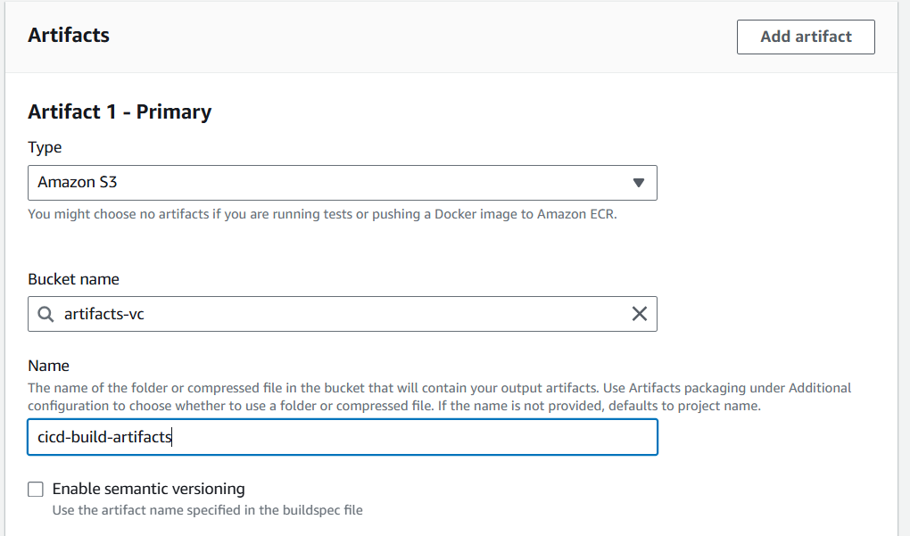

   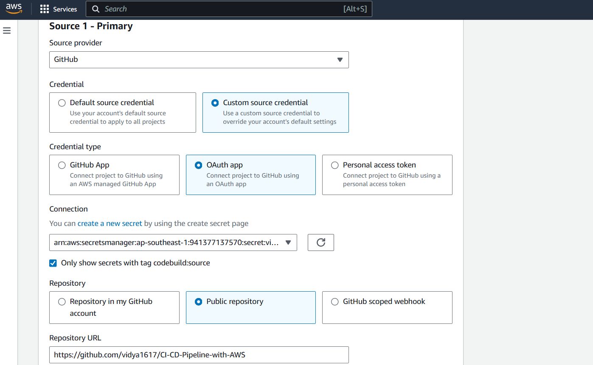

   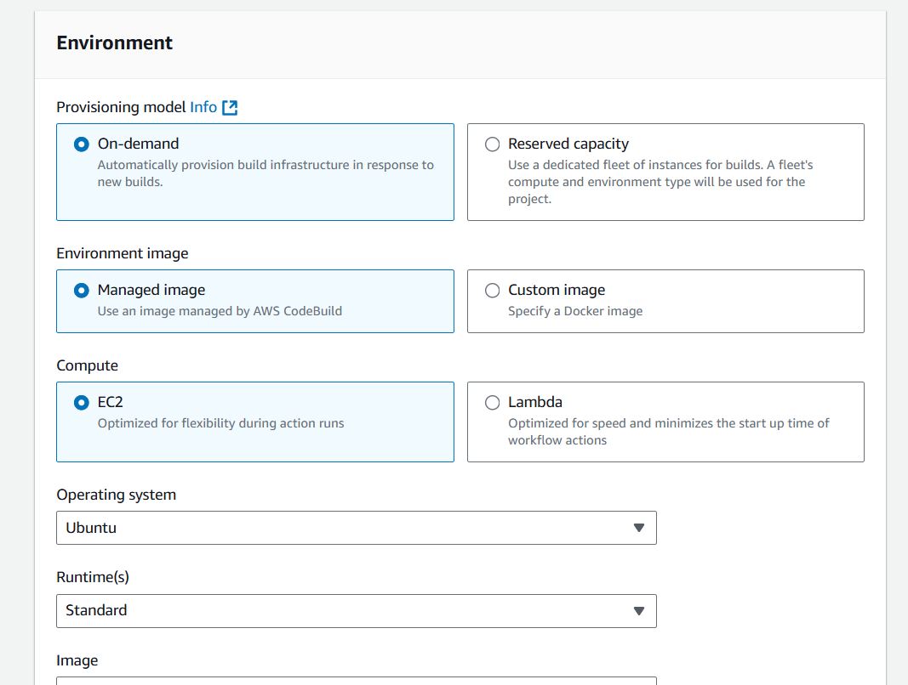
   
   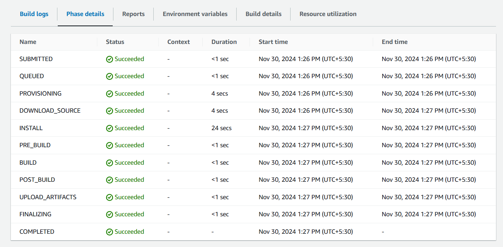
   
   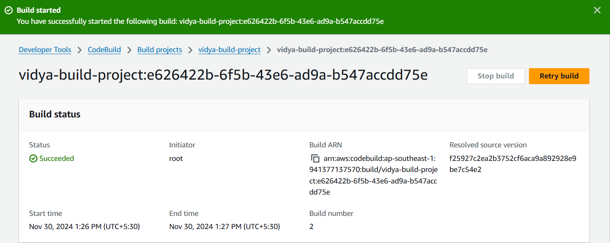

2. **Code-Deploy Configuration**
   
   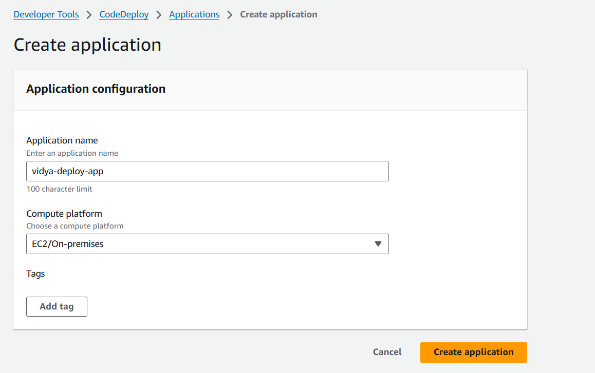

   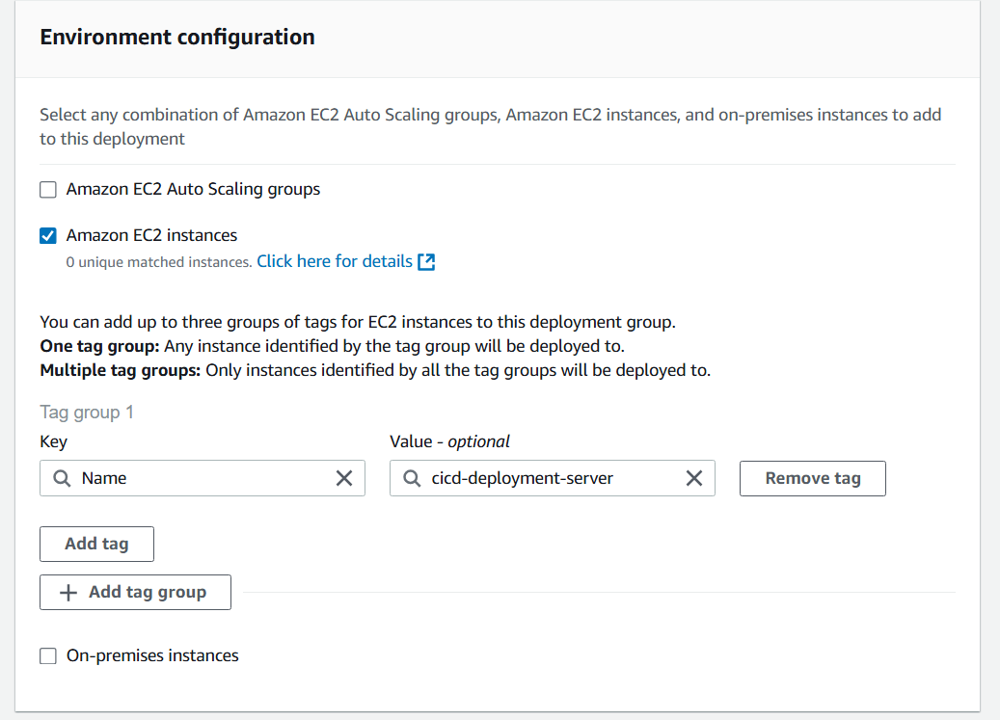

   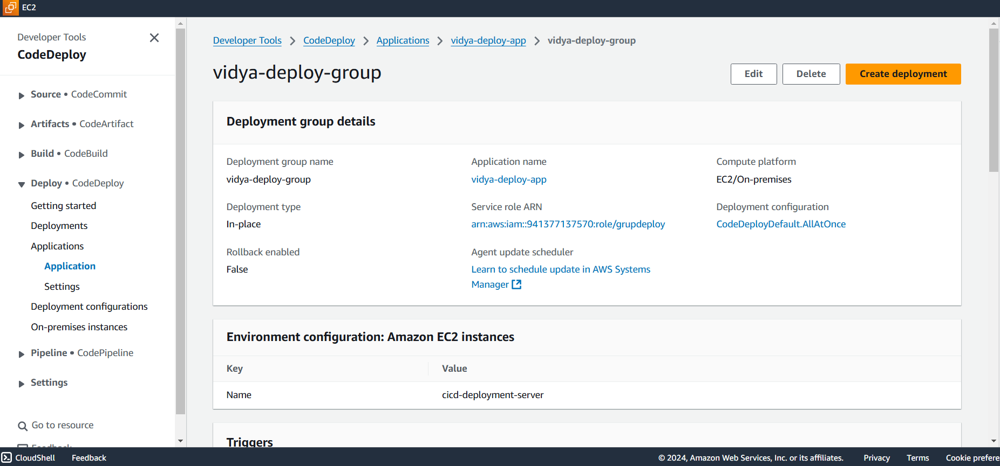
   
   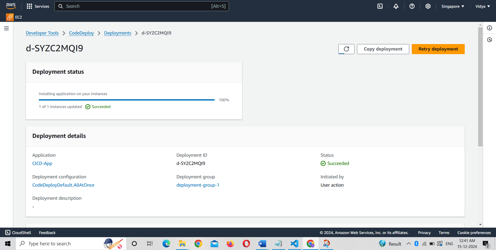

3. **EC2 Configuration**
   
   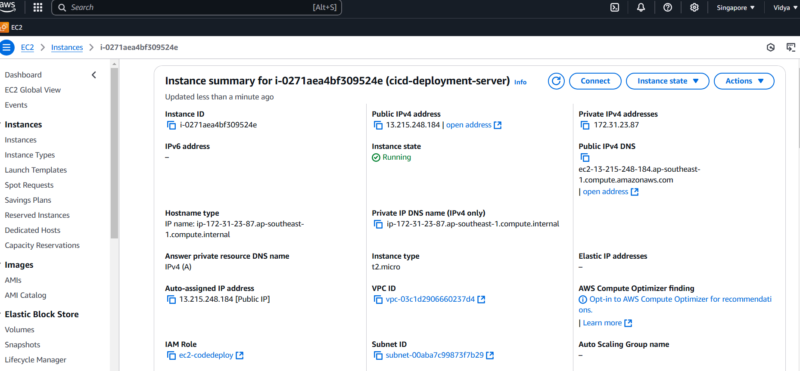

   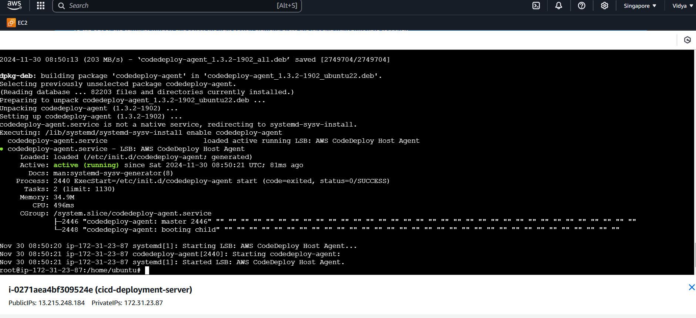

3. **CI/CD Pipeline**
   
   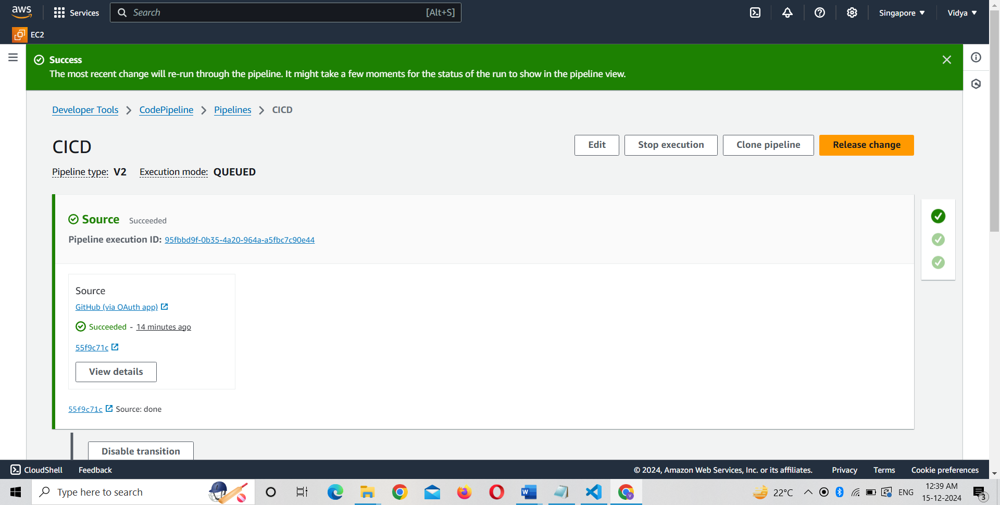

3. **Successful Deployment on EC2**
   
   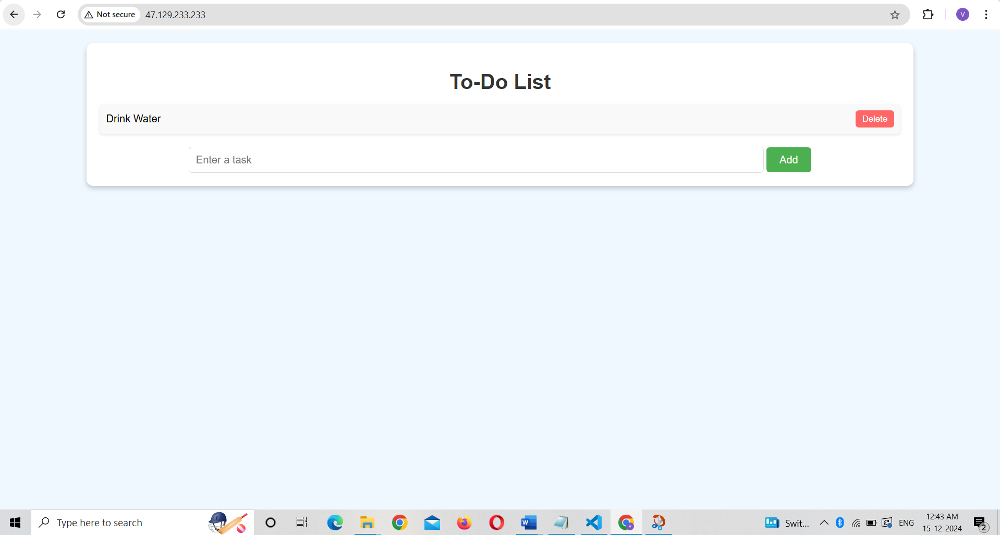


## Contributions:
Feel free to fork the repository and submit pull requests. Contributions are always welcome!

## Contact:
For any inquiries, please contact [vidya](chaudharividya1617@gmail.com).

